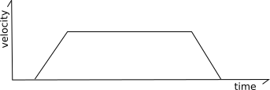
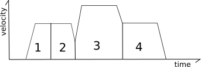
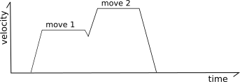
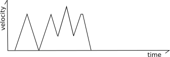
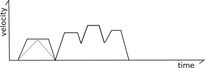
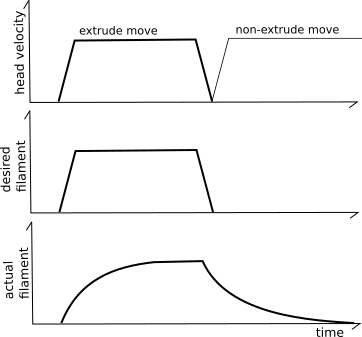

This document provides an overview of how Klipper implements robot
motion (its [kinematics](https://en.wikipedia.org/wiki/Kinematics)).
The contents may be of interest to both developers interested in
working on the Klipper software as well as users interested in better
understanding the mechanics of their machines.

Acceleration
============

Klipper implements a constant acceleration scheme whenever the print
head changes velocity - the velocity is gradually changed to the new
speed instead of suddenly jerking to it.  Klipper always enforces
acceleration between the tool head and the print.  The filament
leaving the extruder can be quite fragile - rapid jerks and/or
extruder flow changes lead to poor quality and poor bed adhesion. Even
when not extruding, if the print head is at the same level as the
print then rapid jerking of the head can cause disruption of recently
deposited filament. Limiting speed changes of the print head (relative
to the print) reduces risks of disrupting the print.

It is also important to enforce a maximum acceleration of the stepper
motors to ensure they do not skip or put excessive stress on the
machine. Klipper limits the acceleration of each stepper by virtue of
limiting the acceleration of the print head. Enforcing acceleration at
the print head naturally also enforces acceleration at the steppers
that control that print head (the inverse is not always true).

Klipper implements constant acceleration.  The key formula for
constant acceleration is:
```
velocity(time) = start_velocity + accel*time
```

Trapezoid generator
===================

Klipper uses a traditional "trapezoid generator" to model the motion
of each move - each move has a start speed, it accelerates to a
cruising speed at constant acceleration, it cruises at a constant
speed, and then decelerates to the end speed using constant
acceleration.



It's called a "trapezoid generator" because a velocity diagram of the
move looks like a trapezoid.

The cruising speed is always greater than or equal to both the start
speed and the end speed. The acceleration phase may be of zero
duration (if the start speed is equal to the cruising speed), the
cruising phase may be of zero duration (if the move immediately starts
decelerating after acceleration), and/or the deceleration phase may be
of zero duration (if the end speed is equal to the cruising speed).



Look-ahead
==========

The "look-ahead" system is used to determine cornering speeds between
moves.

Consider the following two moves contained on an XY plane:


In the above situation it is possible to fully decelerate after the
first move and then fully accelerate at the start of the next move,
but that is not ideal as all that acceleration and deceleration would
greatly increase the print time and the frequent changes in extruder
flow would result in poor print quality.

To solve this, the "look-ahead" mechanism queues multiple incoming
moves and analyzes the angles between moves to determine a reasonable
speed that can be obtained during the "junction" between two moves. If
the next move forms an acute angle (the head is going to travel in
nearly a reverse direction on the next move) then only a small
junction speed is permitted. If the next move is nearly in the same
direction then the head need only slow down a little (if at all).



The junction speeds are determined using "approximated centripetal
acceleration". Best
[described](https://onehossshay.wordpress.com/2011/09/24/improving_grbl_cornering_algorithm/)
by the author.

Klipper implements look-ahead between moves contained in the XY plane
that have similar extruder flow rates. Other moves are rare and
implementing look-ahead between them is unnecessary.

Key formula for look-ahead:
```
end_velocity^2 = start_velocity^2 + 2*accel*move_distance
```

Smoothed look-ahead
-------------------

Klipper also implements a mechanism for smoothing out the motions of
short "zig-zag" moves.  Consider the following moves:



In the above, the frequent changes from acceleration to deceleration
can cause the machine to vibrate which causes stress on the machine
and increases the noise.  To reduce this, Klipper tracks both regular
move acceleration as well as a virtual "acceleration to deceleration"
rate.  Using this system, the top speed of these short "zig zag" moves
are limited to smooth out the printer motion:



In the above, note the dashed gray lines - this is a graphical
representation of the "pseudo acceleration".  Where the two dashed
lines meet enforces a limit on the move's top speed.  For most moves
the limit will be at or above the move's existing limits and no change
in behavior is induced. However, for short "zig-zag" moves the limit
comes into play and it reduces the top speed. Note that the grey lines
represent a pseudo-acceleration to limit top speed only - the move
continues to use it's normal acceleration scheme up to its adjusted
top-speed.

Generating steps
================

Once the look-ahead process completes, the print head movement for the
given move is fully known (time, start position, end position,
velocity at each point) and it is possible to generate the step times
for the move.  This process is done within "kinematic classes" in the
Klipper code.  Outside of these kinematic classes, everything is
tracked in millimeters, seconds, and in cartesian coordinate space.
It's the task of the kinematic classes to convert from this generic
coordinate system to the hardware specifics of the particular printer.

In general, the code determines each step time by first calculating
where along the line of movement the head would be if a step is
taken. It then calculates what time the head should be at that
position. Determining the time along the line of movement can be done
using the formulas for constant acceleration and constant velocity:

```
time = sqrt(2*distance/accel + (start_velocity/accel)^2) - start_velocity/accel
time = distance/cruise_velocity
```

Cartesian Robots
----------------

Generating steps for cartesian printers is the simplest case. The
movement on each axis is directly related to the movement in cartesian
space.

Delta Robots
------------

To generate step times on Delta printers it is necessary to correlate
the movement in cartesian space with the movement on each stepper
tower.


To simplify the math, for each move contained in an XY plane, the code
calculates the location of a "virtual tower" that is along the line of
movement.  This virtual tower is chosen at the point where the line of
movement (extended infinitely in both directions) would be closest to
the actual tower.


It is then possible to calculate where the head will be along the line
of movement after each step is taken on the virtual tower. The key
formula is Pythagoras's theorem:

```
distance_to_tower^2 = arm_length^2 - tower_height^2
```

One complexity is that if the print head passes the virtual tower
location then the stepper direction must be reversed. In this case
forward steps will be taken at the start of the move and reverse steps
will be taken at the end of the move.

### Delta movements beyond simple XY plane ###

Movement calculation is a little more complicated if the move is not
fully contained within a simple XY plane. A virtual tower along the
line of movement is still calculated, but in this case the tower is
not at a 90 degree angle relative to the line of movement:


The code continues to calculate step times using the same general
scheme as delta moves within an XY plane, but the slope of the tower
must also be used in the calculations.

Should the move contain only Z movement (ie, no XY movement at all)
then the same math is used - just in this case the tower is parallel
to the line of movement (its slope is 1.0).

### Stepper motor acceleration limits ###

With delta kinematics it is possible for a move that is accelerating
in cartesian space to require an acceleration on a particular stepper
motor greater than the move's acceleration. This can occur when a
stepper arm is more horizontal than vertical and the line of movement
is near that stepper's tower.

Klipper does enforce a maximum ceiling on stepper acceleration that is
three times the maximum acceleration of a move in cartesian
space. (Similarly, the maximum velocity of the stepper is limited to
three times the maximum move velocity.) In order to enforce this
limit, moves at the extreme edge of the build envelope (where a
stepper arm may be nearly horizontal) will have a lower maximum
acceleration and velocity.

Extruder kinematics
-------------------

Klipper implements extruder motion in its own kinematic class.  Since
the timing and speed of each print head movement is fully known for
each move, it's possible to calculate the step times for the extruder
independently from the step time calculations of the print head
movement.

Basic extruder movement is simple to calculate. The step time
generation uses the same constant acceleration and constant velocity
formulas that cartesian robots use.

### Pressure advance ###

Experimentation has shown that it's possible to improve the modeling
of the extruder beyond the basic extruder formula. In the ideal case,
as an extrusion move progresses, the same volume of filament should be
deposited at each point along the move and there should be no volume
extruded after the move. Unfortunately, it's common to find that the
basic extrusion formulas cause too little filament to exit the
extruder at the start of extrusion moves and for excess filament to
extrude after extrusion ends. This is often referred to as "ooze".



The "pressure advance" system attempts to account for this by using a
different model for the extruder. Instead of naively believing that
each mm^3 of filament fed into the extruder will result in that amount
of mm^3 immediately exiting the extruder, it uses a model based on
pressure. Pressure increases when filament is pushed into the extruder
(as in [Hooke's law](https://en.wikipedia.org/wiki/Hooke%27s_law)) and
the pressure necessary to extrude is dominated by the flow rate
through the nozzle orifice (as in
[Poiseuille law](https://en.wikipedia.org/wiki/Poiseuille_law)). The
key idea is that the relationship between filament, pressure, and flow
rate can be modeled using a linear coefficient:
```
extra_filament = pressure_advance_coefficient * extruder_velocity
```

See the [pressure advance](Pressure_Advance.md) document for
information on how to find this pressure advance coefficient.

Once configured, Klipper will push in an additional amount of filament
during acceleration. The higher the desired filament flow rate, the
more filament must be pushed in during acceleration to account for
pressure. During head deceleration the extra filament is retracted
(the extruder will have a negative velocity).


One may notice that the pressure advance algorithm can cause the
extruder motor to make sudden velocity changes. This is tolerated
based on the idea that the majority of the inertia in the system is in
changing the extruder pressure. As long as the extruder pressure does
not change rapidly the sudden changes in extruder motor velocity are
tolerated.

One area where sudden velocity changes become problematic is during
small changes in head speed due to cornering.


To prevent this, the Klipper pressure advance code utilizes the move
look-ahead queue to detect intermittent speed changes. During a
deceleration event the code finds the maximum upcoming head speed
within a configurable time window. The pressure is then only adjusted
to this found maximum. This can greatly reduce (or even completely
eliminate) pressure changes during cornering.
