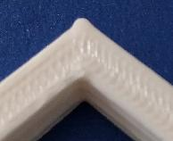

This document provides information on tuning the "pressure advance"
configuration variables for a particular nozzle and filament. The
pressure advance feature can be helpful in reducing ooze. For more
information on how pressure advance is implemented see the
[kinematics](Kinematics.md) document.

Tuning pressure advance
=======================

Pressure advance does two useful things - it reduces ooze during
non-extrude moves and it reduces blobbing during cornering. This guide
uses the second feature (reducing blobbing during cornering) as a
mechanism for measuring and tuning the pressure advance configuration.

Start by changing the extruder section of the config file so that
pressure_advance is set to 0.0. (Make sure to issue a RESTART command
after each update to the config file so that the new configuration
takes effect.) Then print at least 10 layers of a large hollow square
at high speed (eg, 100mm/s). See
[docs/prints/square.stl](prints/square.stl) file for an STL file that
one may use. While the object is printing, make a note of which
direction the head is moving during external perimeters. What many
people see here is blobbing occurring at the corners - extra filament
at the corner in the direction the head travels followed by a possible
lack of filament on the side immediately after that corner:

This blobbing is the result of pressure in the extruder being released
as a blob when the head slows down to corner.

The next step is to set pressure_advance_lookahead_time to 0.0, slowly
increase pressure_advance (eg, start with 0.05), and reprint the test
object. (Be sure to issue RESTART between each config change.) The
goal is to attempt to eliminate the blobbing during cornering. (With
pressure advance, the extruder will retract when the head slows down,
thus countering the pressure buildup and ideally eliminate the
blobbing.) If a test run is done with a pressure_advance setting that
is too high, one typically sees a dimple in the corner followed by
possible blobbing after the corner (too much filament is retracted
during slow down and then too much filament is extruded during the
following speed up after cornering):

The goal is to find the smallest pressure_advance value that results
in good quality corners:

Typical pressure_advance values are between 0.05 and 0.20 (the high
end usually only with bowden extruders).

Once a good pressure_advance value is found, return
pressure_advance_lookahead_time to its default (0.010). This parameter
controls how far in advance to check if a head slow-down is
immediately followed by a speed-up - it reduces pointless pressure
changes in the head. It's possible to tune this - higher values will
decrease the number of pressure changes in the nozzle at the expense
of permitting more blobbing during cornering. (Tuning this value is
unlikely to impact ooze.) The default of 10ms should work well on most
printers.

Although this tuning exercise directly improves the quality of
corners, it's worth remembering that a good pressure advance
configuration can reduce ooze throughout the print.

Finally, once pressure_advance is tuned in Klipper, it may still be
useful to configure a small retract value in the slicer (eg, 0.75mm)
and to utilize the slicer's "wipe on retract option" if available.
These slicer settings may help counteract ooze caused by filament
cohesion (filament pulled out of the nozzle due to the stickiness of
the plastic). It is recommended to disable the slicer's "z-lift on
retract" option.
