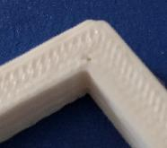
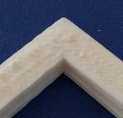

This document provides information on tuning the "pressure advance"
configuration variable for a particular nozzle and filament. The
pressure advance feature can be helpful in reducing ooze. For more
information on how pressure advance is implemented see the
[kinematics](Kinematics.md) document.

Tuning pressure advance
=======================

Pressure advance does two useful things - it reduces ooze during
non-extrude moves and it reduces blobbing during cornering. This guide
uses the second feature (reducing blobbing during cornering) as a
mechanism for tuning.

In order to calibrate pressure advance the printer must be configured
and operational. The tuning test involves printing objects and
inspecting the differences between objects. It is a good idea to read
this document in full prior to running the test.

Use a slicer to generate g-code for the large hollow square found in
[docs/prints/square.stl](prints/square.stl). Use a high speed (eg,
100mm/s) and a coarse layer height (the layer height should be around
75% of the nozzle diameter). It is fine to use a low infill (eg, 10%).

Prepare for the test by issuing the following G-Code commands:
`SET_VELOCITY_LIMIT SQUARE_CORNER_VELOCITY=1 ACCEL=500` and
`SET_PRESSURE_ADVANCE ADVANCE_LOOKAHEAD_TIME=0`. These commands make
the nozzle travel slower through corners and they emphasize the
effects of extruder pressure.

For the first print use a pressure advance of zero by running
`SET_PRESSURE_ADVANCE ADVANCE=0.000`. Then print at least 10 layers of
the test object. While the object is printing, make a note of which
direction the head is moving during external perimeters. What many
people see here is blobbing occurring at the corners - extra filament
at the corner in the direction the head travels followed by a possible
lack of filament on the side immediately after that corner:

This blobbing is the result of pressure in the extruder being released
as a blob when the head slows down to corner.

The next step is to increase pressure advance (start with
`SET_PRESSURE_ADVANCE ADVANCE=0.050`) and reprint the test object.
With pressure advance, the extruder will retract when the head slows
down, thus countering the pressure buildup and ideally eliminate the
blobbing.

If a test run is done with a pressure advance setting that is too
high, one typically sees a dimple in the corner followed by possible
blobbing after the corner (too much filament is retracted during slow
down and then too much filament is extruded during the following speed
up after cornering):

The goal is to find the smallest pressure advance value that results
in good quality corners:

Typical pressure advance values are between 0.050 and 1.000 (the high
end usually only with bowden extruders). If there is no significant
improvement after gradually increasing pressure advance to 1.000, then
pressure advance is unlikely to improve the quality of prints. Return
to a default configuration with pressure advance disabled.

Although this tuning exercise directly improves the quality of
corners, it's worth remembering that a good pressure advance
configuration also reduces ooze throughout the print.

At the completion of this test, update the extruder's pressure_advance
setting in the configuration file and issue a RESTART command. The
RESTART command will also return the acceleration, cornering speeds,
and look-ahead times to their normal values.

Important Notes
===============

* The pressure advance value is dependent on the extruder, the nozzle,
  and the filament. It is common for filament from different
  manufactures or with different pigments to require significantly
  different pressure advance values. Therefore, one should calibrate
  pressure advance on each printer and with each spool of filament.

* Printing temperature and extrusion rates can impact pressure
  advance.  Be sure to tune the extruder
  [E steps](http://reprap.org/wiki/Triffid_Hunter%27s_Calibration_Guide#E_steps)
  and
  [nozzle temperature](http://reprap.org/wiki/Triffid_Hunter%27s_Calibration_Guide#Nozzle_Temperature)
  prior to tuning pressure advance.

* It is not unusual for one corner of the test print to be
  consistently different than the other three corners. This typically
  occurs when the slicer arranges to always change Z height at that
  corner. If this occurs, then ignore that corner and tune pressure
  advance using the other three corners.

* Check for warping at the corners during the test prints (the corners
  detaching from the bed and rising a small distance upwards during
  the print). If one corner appears warped then ignore that corner
  when tuning. If significant warping is seen throughout the test then
  typical solutions are to reduce the slicer's first layer speed,
  adjust the bed temperature, and/or to use the slicer's brim feature.
  Pressure advance itself is unlikely to impact warping, but this
  tuning test is sensitive to it.

* If a high pressure advance value (eg, over 0.200) is used then one
  may find that the extruder skips when returning to the printer's
  normal acceleration. The pressure advance system accounts for
  pressure by pushing in extra filament during acceleration and
  retracting that filament during deceleration. With a high
  acceleration and high pressure advance the extruder may not have
  enough torque to push the required filament. If this occurs, either
  use a lower acceleration value or disable pressure advance.

* The pressure_advance_lookahead_time parameter controls how far in
  advance to check if a head slow-down is immediately followed by a
  speed-up - it reduces pointless pressure changes in the head. It is
  recommended to follow the steps above so that it is set to zero
  during tuning and to use the default (0.010) during normal prints.
  It is possible to tune this setting - higher values will reduce the
  amount of pressure change in the nozzle during cornering, but
  setting it too high can cause blobbing during cornering. (Tuning
  this value is unlikely to impact ooze.) The default of 10ms should
  work well on most printers.

* Once pressure advance is tuned in Klipper, it may still be useful to
  configure a small retract value in the slicer (eg, 0.75mm) and to
  utilize the slicer's "wipe on retract option" if available. These
  slicer settings may help counteract ooze caused by filament cohesion
  (filament pulled out of the nozzle due to the stickiness of the
  plastic). It is recommended to disable the slicer's "z-lift on
  retract" option.
